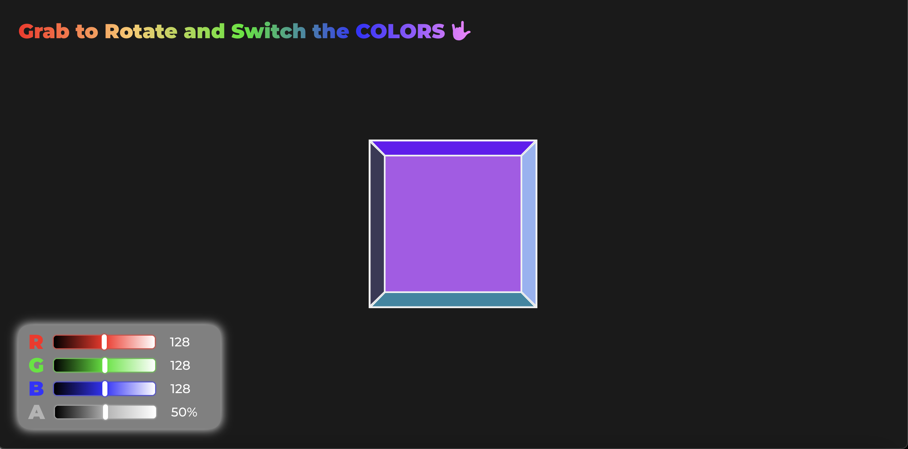
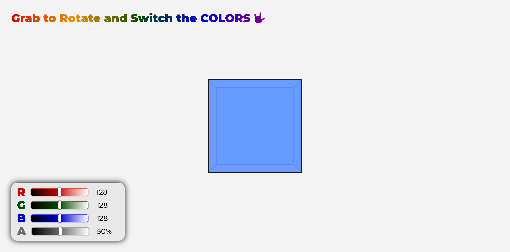
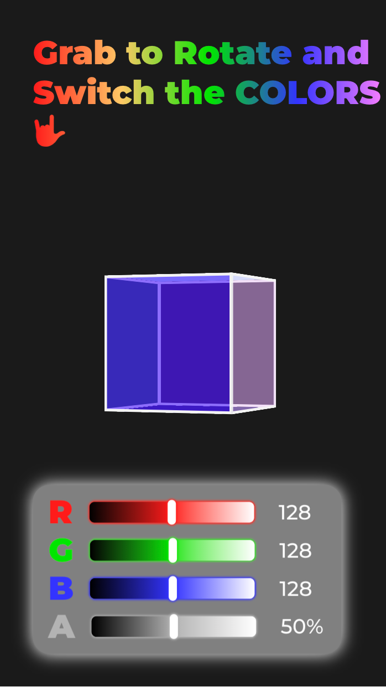
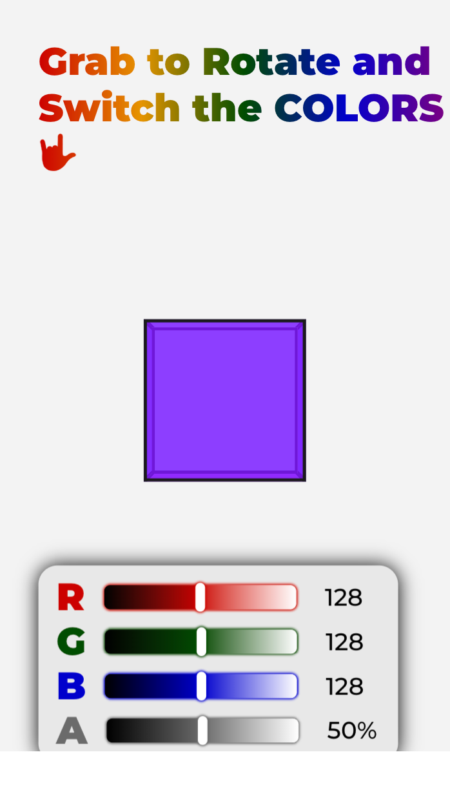

# JS30 - CSS custom property practice - cube rotation and changing colors
## Table of contents
  - [Overview](#overview)
    - [The challenge](#the-challenge)
    - [Screenshot](#screenshot)
    - [Links](#links)
  - [My process](#my-process)
    - [Built with](#built-with)
    - [What I learned](#what-i-learned)
    - [Continued development](#continued-development)
    - [Useful resources](#useful-resources)
  - [Author](#author)
  - [Acknowledgments](#acknowledgments)

## Overview

### The challenge

The main purpose of this challenge is to practice how to use the css custom properties.
After searching and reading the css custom properties

Users should be able to:

- use mouse to rotate the cube whatever degree he/she wants.
- use touch device to rotate the cube whatever degree he/she wants.
- click or focus any side of the cube, the side would start the animation.
- click any side of the cube to see what the current **RGBA** value it is.
- change the specific side **RGBA** value by the beneath input controller.

### Screenshot

  
  

### Links

- Solution URL: [GitHub](https://github.com/Beginneraboutlife116/JS30-03-CSS-variables)
- Live Site URL: [live site URL](https://beginneraboutlife116.github.io/JS30-03-CSS-variables/)

## My process

### Built with

- Semantic HTML5 markup
- CSS custom properties
- Flexbox
- CSS Grid
- Mobile-first workflow
- SASS
- JS class
- Touch Event

### What I learned

- In this challenge, I have reviewed this article: [A Complete Guide to Custom Properties](https://css-tricks.com/a-complete-guide-to-custom-properties/) about whole concept.
  - What I have learned from this article are:
    1. CSS custom properties could make CSS value be more semantic.
    2. CSS custom properties are good for color-theme changing.
    3. CSS custom properties have scope effect. That is if the parent or itself has CSS custom property, their child or pseudo-class, pseudo-element could use this CSS custom property to set the style.
    4. CSS custom properties also have better control on animation start or pause.
- I also learned how to make 3D element by using perspective and make the cube.
  - We need to set `perspective` and `perspective-origin` on the parent element.
  - And then, we also need to set `transform-style: preserve-3d;` on the element you want to look as 3D.
- Using some Sass techniques to help me cut down my time to write too much CSS code:
  - especially when I was styling my range input, because there were a lot of `-webkit-`, `-moz-` for specific color input, I tried to use `@each`, `@if`, `@else`, `@mixin`, `@include` to help me just putting a `$colors` list to achieve all styling.
- I also practice how to write a class, and in this practice, I also try to use `get` and `set` to make some called **two-way binding**.
  - I think I'm mimic that from Vue, but still not sure.
- Also, at last, I make some touch event for mobile case, like `touchstart`, `touchmove`, `touchend` to achieve cube rotation as like using mouse.
  - But in the input on mobile, I still need to solve the issue why I can't adjust input value directly. Still trying.
### Continued development

- I still try to make mobile use case fluently, especially on the range input input.
- Improve some user experience from my friends. Like:
  - Hide the input controller until any cube side has been clicked.

### Useful resources

- [Example resource 1](https://www.example.com) - This helped me for XYZ reason. I really liked this pattern and will use it going forward.
- [Example resource 2](https://www.example.com) - This is an amazing article which helped me finally understand XYZ. I'd recommend it to anyone still learning this concept.

**Note: Delete this note and replace the list above with resources that helped you during the challenge. These could come in handy for anyone viewing your solution or for yourself when you look back on this project in the future.**

## Author

- Website - [Add your name here](https://www.your-site.com)
- Frontend Mentor - [@yourusername](https://www.frontendmentor.io/profile/yourusername)
- Twitter - [@yourusername](https://www.twitter.com/yourusername)

**Note: Delete this note and add/remove/edit lines above based on what links you'd like to share.**

## Acknowledgments

This is where you can give a hat tip to anyone who helped you out on this project. Perhaps you worked in a team or got some inspiration from someone else's solution. This is the perfect place to give them some credit.

**Note: Delete this note and edit this section's content as necessary. If you completed this challenge by yourself, feel free to delete this section entirely.**